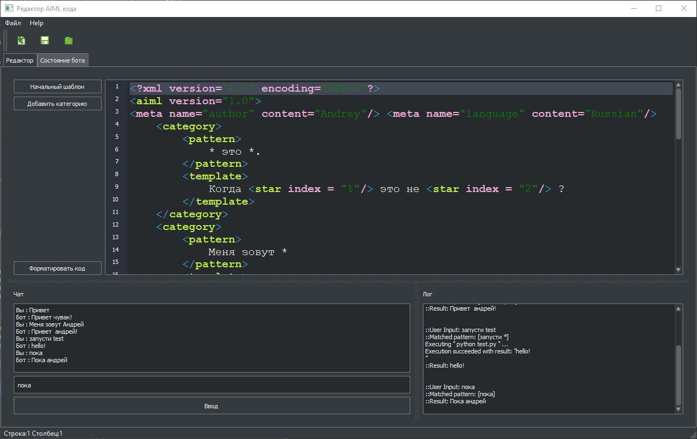
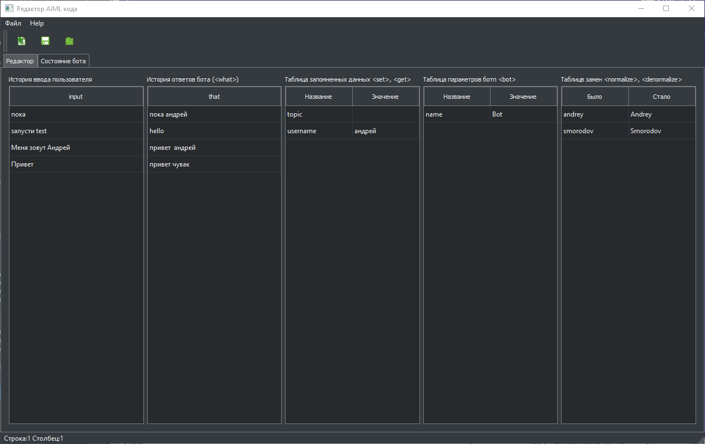

##Программа для создания AIML чат ботов##
#Интерфейс программы#
Интерфейс состоит из двух главных вкладок:
* Вкладка редактора кода и отладки бота;
* Вкладка состояния бота.

Неплохое руководство по AIML 2.0 : [https://callmom.pandorabots.com/static/reference/](https://callmom.pandorabots.com/static/reference/ "AIML 2.0 reference")

#Used projects#

* Code based on AIML interpreter: [https://sourceforge.net/projects/qaiml/](https://sourceforge.net/projects/qaiml/ "ProgramQ") 
* Standard code highlighter example from Qt
* Standard code editor example from Qt